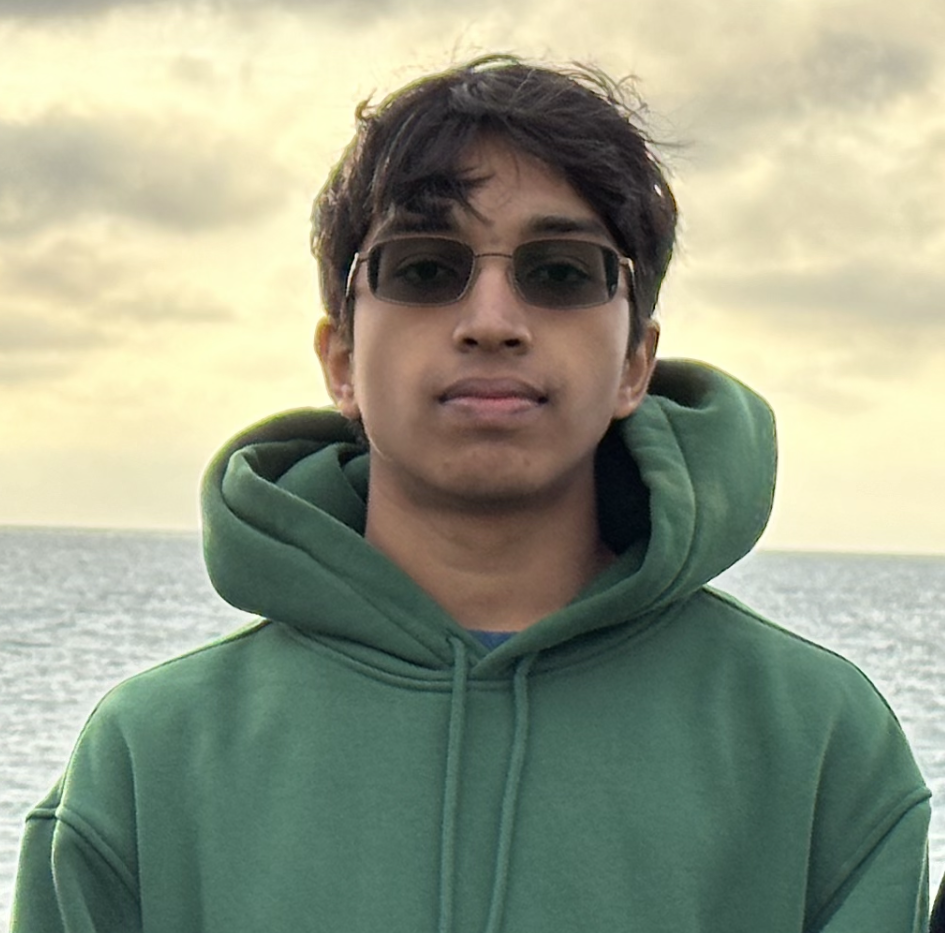

# Yuvanand Saravanan

## This is me!




I am a * *second-year* * **Computer Engineering** major at UCSD.


One of my favorite quotes is as follows:
> You don’t become confident by shouting affirmations in the mirror, but by having a stack of undeniable proof that you are who you say you are. 
> Outwork your self-doubt.
> -- Alex Hormozi


## Code

Here's some cool C code:
```C
char* easy_str_copy(char* dest, char* src) {
    while (*dest++ = *src++); // This can do the job if the destination buffer is large enough!
}
```


My proudest personal project is [ChessBot](https://github.com/yuvasaro/chess), a Chess Discord bot with a built-in AI!


## Talking About Me Again

[Go back to the section about me](#this-is-me) if you wish :)

While you're checking me out again, here's a [link to the image file of the picture of me](IMG_8540.PNG).


Some of my hobbies include:
- Biking
- Weightlifting
- Watching YouTube
- Playing video games
- Eating good food!


Classes I'm taking this quarter (I may drop one):
1. CSE 110
2. CSE 140/140L
3. ECE 65
4. ECE 101
5. CHEM 11


- [x] Have you read my introduction?
- [ ] Have you seen my personal project?
